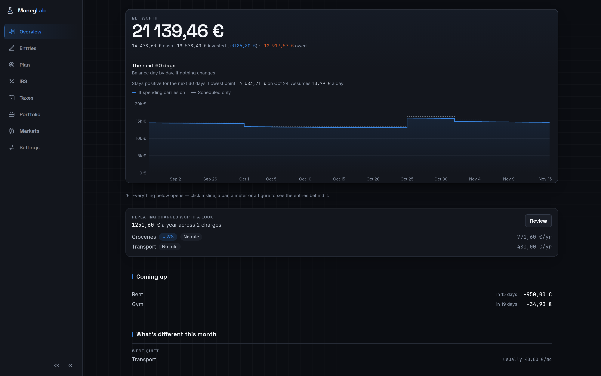
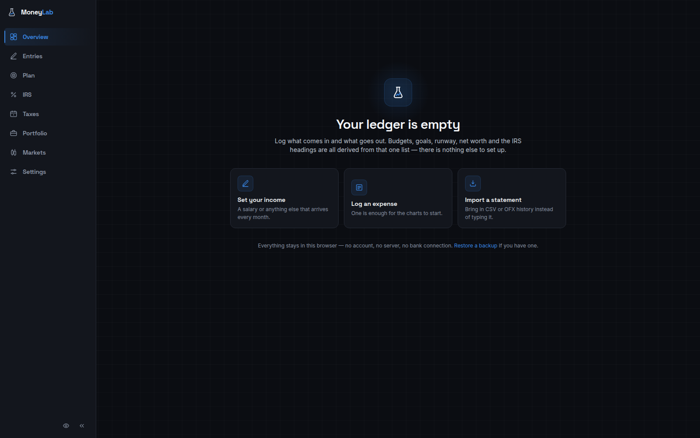
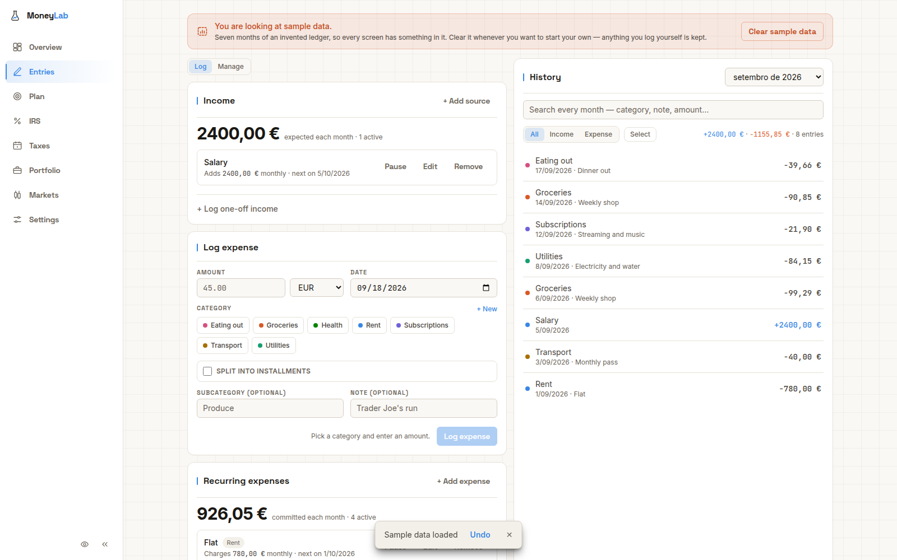
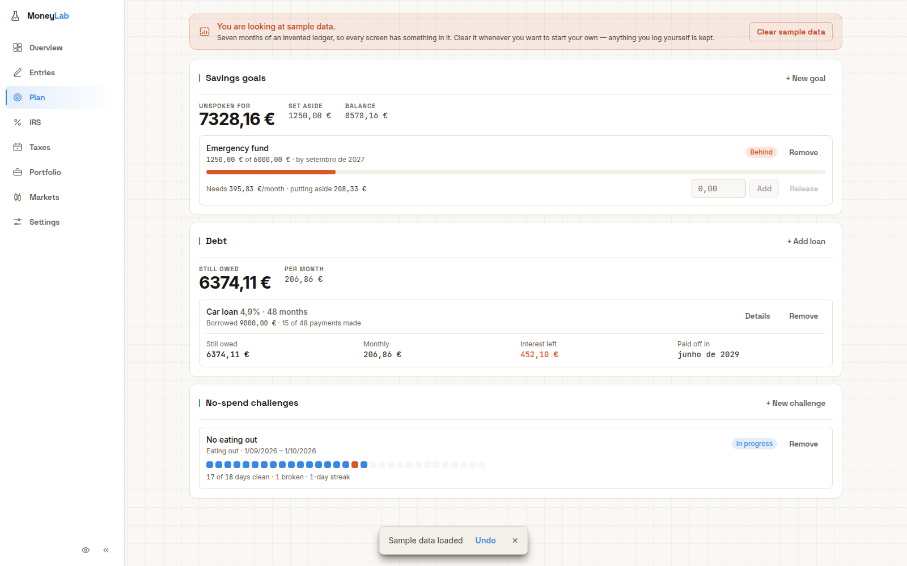
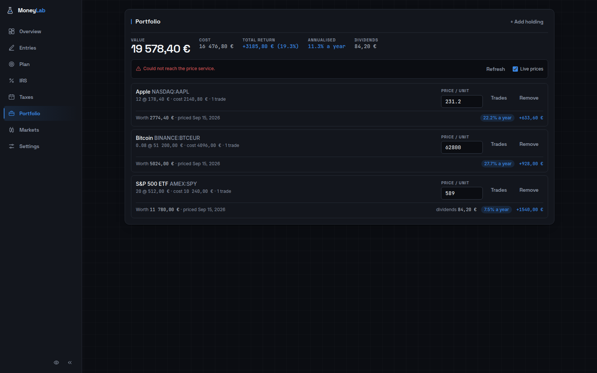
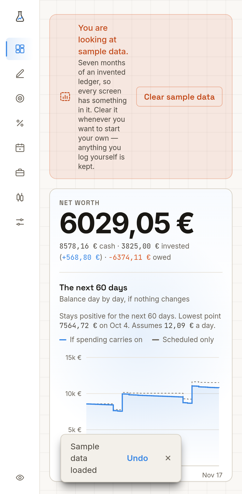

<div align="center">


# 💸 MoneyLab

### Personal finance that never leaves your browser.

Log what comes in and what goes out. **Everything else is derived from that one ledger** —
budgets, recurring bills, savings goals, debt payoff, a stock and crypto portfolio,
Portuguese IRS deductions.

**No accounts. No server. No bank connections.** 🔒

<br />

[](https://github.com/escobar0304/MoneyLab/actions/workflows/ci.yml)


<br />



</div>

---

## 🧪 Why it works this way

> **Nothing here is stored as mutable state.**
> Every action appends one event to a single append-only log. Every figure and
> chart is computed from that array on the fly — never written down.

|  | |
|---|---|
| 🔐 **Local-only** | Your ledger lives in `localStorage`, in one browser. Nothing is uploaded, ever — deploying it somewhere changes where the *code* is served from, not where the data lives. |
| 🧾 **One source of truth** | Budgets, runway, net worth and tax headings are all *derived*. Nothing can drift out of sync with its history. |
| ⏳ **Time travel is free** | "As of a past date" is just a filter over the same array — no second history to keep. |
| 📦 **Your data is one JSON array** | That's literally what "export" writes to disk. |
| 📴 **Works offline** | Installable PWA, fonts bundled, no CDN in the critical path. |

---

## ⚡ Quick start

```bash
npm install
npm run dev        # 🚀 local dev server
npm run test       # 🧪 unit + derivation suite
npm run test:e2e   # 🎭 Playwright end-to-end
npm run build      # 📦 type-check + production build
```

> 💡 There's nothing to configure and no account to make. Open it and start logging.

---

## 🚀 Hosting it

Running it on your own machine is the default and nothing here changes that.
Deploying is worth it for one specific reason: **a phone.** Reached over plain HTTP
from a LAN address, browsers withhold `crypto.subtle`, service worker registration
and the File System Access API — which silently disables **encrypted export**,
**installing the app**, and **automatic folder backup**. `localhost` is already a
secure context, so on the desktop where the container runs you lose none of that;
over `192.168.x.x` you lose all three. HTTPS gives them back.

```bash
fly launch --no-deploy   # once, to claim the app name
fly deploy
```

`fly.toml` is committed. It scales to zero when idle, so an idle instance costs
nothing and the first request after a quiet spell pays about a second to wake.

**This does not put your ledger on a server, because there is no server-side state
to put it in** — no database, no sessions, no accounts. Whoever opens the URL gets
an empty app and the offer of sample data. What *does* change is that the three
lookup proxies now run on someone else's hardware: a date and a currency code, the
text typed into symbol search, and your list of ticker symbols would pass through
it. Not amounts, not quantities, not entries. If that trade isn't worth it to you,
the honest answer is to keep using the local container and deploy only the public
instance you hand to other people — the code is identical and neither holds data.

Because a public URL makes those proxies callable by anyone, they're rate-limited
per client in `nginx.conf`, keyed on `Fly-Client-IP` where it's present so one
visitor can't spend everybody else's budget.

---

## 🖼️ A look around

|  |  |
|---|---|
|  |  |
| **🌱 First run** — three next steps that each go where they point, plus sample data to explore first. | **✍️ Entries** — log on the left, the full searchable history on the right. |
|  |  |
| **🎯 Plan** — goals, debt payoff and no-spend challenges. | **📈 Portfolio** — holdings, live prices, FIFO capital gains. |

<div align="center">

<br /><em>📱 The rail collapses to icons under 640px.</em>
</div>

---

## 🧭 Features

### ✍️ Income & expenses

The **Entries** tab splits into **Log** and **Manage** (a `Segmented` control switches
between them, History stays visible either way) — so logging a coffee and merging two
mistyped categories aren't presented as the same kind of task. One happens daily, the
other happens once in a while to keep Log honest.

<details>
<summary><b>📝 Log — what posts an entry</b></summary>

- One-off income and expenses: amount, date, a free-text category (with autocomplete),
  optional subcategory, note, and multiple pots (accounts) to post against.
- **🔁 Recurring rules** for anything monthly — salary, rent, a subscription — income and
  expense alike. Elapsed cycles are caught up on load with their real historical dates,
  and any single month can be skipped without deleting the rule.
- **🌍 Multi-currency entries**: log in another currency and it's converted to the base
  currency (EUR) via ECB reference rates, with the original amount and rate kept
  alongside for the audit trail.
- **✂️ Split a purchase into installments** — post one expense over N months instead of a
  single lump sum, with an optional annual interest rate. Reuses the same amortization
  math as the Debt tab, so an interest-free split divides evenly (last month absorbs the
  rounding) and a financed one is the real fixed monthly payment a lender would quote.
  Each posted entry carries its place in the group ("3 of 12").

</details>

<details>
<summary><b>🗂️ Manage — the setup that keeps Log honest</b></summary>

- **🏦 Bank statement import** (CSV/OFX) previewed before anything is written, plus
  **rules** that auto-categorize matching entries by text, amount, or category — one
  primitive driving both import auto-filing and manual tidy-up.
- **🪣 Accounts** — divide the balance into pots (main, savings, investment, other) and
  transfer between them; the sum is always the one true balance.
- **📊 Budgets** — a monthly spending limit per category, shown as a meter against this
  month's spend.
- **🔔 Subscriptions** — detected from repeating charges in your own history, with a
  price-rise called out and a one-click way to turn one into a recurring rule.
- **🏷️ Categories** — rename or merge (accent/case-folded, so "Saúde" and "saude" are
  caught), updating every entry, rule and budget at once.

</details>

Always available in both sections: marking an entry **reconciled** against the bank,
without touching the record of what actually happened — that lives in History.

### 🎯 Planning

- **🏁 Goals** — earmark part of the balance toward a target, with a deadline and a
  required-pace-vs-actual-pace read on whether you're on track. A goal that's reached
  says so, with a one-off glow on the transition into it rather than on every later
  render.
- **🏦 Debt** — a loan's amortization schedule from principal/rate/term, plus a "what if I
  overpaid" projection of months and interest saved.
- **🚫 No-spend challenges** — a self-imposed window ("no takeaway for 30 days") over
  categories you pick by hand.

  <details>
  <summary><em>Why it never blocks anything</em></summary>

  Purely a tracker, never an enforcement: nothing stops an expense from posting in a
  challenged category, it only reports afterwards which days in the window stayed clean.
  A blocked expense would just get logged a day late or under a different category, which
  teaches nothing; a visible day-by-day pattern does. A window that ran its full course
  without a single charge is marked a **clean run** — only once it's over, since
  congratulating an unfinished one is how a tracker starts lying to the person using it.

  </details>

- **🇵🇹 IRS deductions** — map your categories to Portuguese IRS deduction headings and
  track spend against each heading's annual ceiling, with an editable ceiling since the
  published rates move every state budget. Purely informative: your accountant already
  has every invoice through e-fatura, so this is for knowing where a ceiling stands
  *before* the return is filed, not for handing anything over.

### 📅 Taxes

Dates that happen on a fixed day whether you look or not — kept apart from Plan and IRS
for exactly that reason.

- **🗓️ Fiscal calendar** — the IRS (Modelo 3) filing deadline and every vehicle's IUC
  payment(s), merged into one sorted list with days-until.
- **🚗 Vehicles**, tracked only for their IUC due date.

  <details>
  <summary><em>Why the amount is typed in, not computed</em></summary>

  The real formula depends on cylinder capacity, CO2 and a table that moves every state
  budget — and a tax *liability* is the one place in this app where a plausible-looking
  wrong number is worse than no number at all. What the app does reliably is the date
  arithmetic. **Installments** are optional and off by default (one payment, the full
  amount, in the registration month), there for the announced rule that splits IUC
  depending on how much is owed. Logging the actual payment as an expense and **tagging
  it to the vehicle** settles that cycle: the due date drops off the calendar instead of
  sitting there already paid, and reappears once the next cycle arrives.

  </details>

### 📈 Portfolio

- Holdings (shares, funds, crypto) with buy/sell trades and dividends — cost basis and
  return computed from the **trade log** rather than a single average.
- **🔴 Live prices**, polled periodically and merged into net worth; paused when the tab
  isn't visible.
- **🧾 Capital gains**, year by year, matched **FIFO** (oldest lot sold first).

  <details>
  <summary><em>Why FIFO is a second, independent pass</em></summary>

  It runs separately from the average-cost figures shown against each position, because
  "was this lot held over a year" is a question average cost has already blended away.
  **Export for accountant** turns a year into a CSV: every closed lot (symbol, quantity,
  acquired, disposed, days held, gain/loss) plus totals. Portuguese securities are taxed
  at a flat rate regardless of holding period; crypto held over 365 days is currently
  exempt — this file has no reliable way to tell a stock from a crypto-asset by its
  symbol, so "days held" is left for the reader to apply that split by hand.

  </details>

### 🌐 Markets

On its own tab from Portfolio, since owning something and watching it change happen on
different rhythms.

- A **TradingView chart embed** and a symbol **watchlist** for anything you're tracking,
  priced or not.
- For the selected symbol: a **technical rating**, a **symbol info** strip, and recent
  **news**.
- **🔭 Explore markets** — a market overview (indices, crypto, forex) and a **trending**
  list (today's gainers/losers/most active), both independent of your watchlist.
- Every embed mounts only once it scrolls near the viewport (an `IntersectionObserver`,
  not a timer) — with five or six on one page, loading them all at once starves the
  browser's per-host connection limit and the lower ones never finish.
- **🔒 Every embed runs in a frame of its own**, sandboxed without
  `allow-same-origin`, so TradingView's code gets an opaque origin and cannot read the
  ledger. See the security note below.

### 📊 Dashboard & insight

- **🌱 First run** — on an empty ledger the Overview is a proper welcome instead of a
  dashboard with nothing in it: three next steps that each navigate where they point,
  since the one state with no data behind it is also the first one most people see.
- **🧪 Sample data** — a fourth way in, for anyone who would rather look before typing:
  seven months of an invented ledger that lights up every screen — budgets against real
  overruns, a debt part-way through its schedule, FIFO gains on a holding kept over a
  year, IRS headings with two ceilings already reached. Every sample event's id carries a
  `demo-` prefix, and real ids are UUIDs, so the two sets **cannot collide** — clearing
  the demo is a filter that provably can't take a real entry with it, even if you started
  logging on top of it. An orange banner sits on every screen until it's gone.
- **💰 Net worth** (or balance, until there's a portfolio or debt to compose it from) as
  the one headline figure, with a **60-day cash runway** underneath it.
- **📉 Trends** — net worth, income-vs-expenses, savings rate, spend by category over time.
- **🗓️ Monthly snapshot** — budget meter, saved/spent with deltas against last month *and*
  the same month last year, a month-end forecast, where the money went, what changed, and
  outsized charges worth a look.
- **🔍 Drill-down** — click any chart mark to see the underlying entries.
- **⏳ Time travel** — the whole dashboard as it stood on a past date. Free, because the
  ledger is append-only and that view is just a filter over it.
- **🔔 Subscription alerts** — an undeclared or repriced repeating charge gets its own card
  (nothing shows when there's nothing to flag), with a jump straight to Manage.
- **📌 Coming up** — the next 30 days of scheduled charges and income. Reuses the same
  projection the runway is built from, so the list and the balance line can never
  disagree.

<details>
<summary><b>🧠 The reflective bits</b></summary>

- **What's different this month** — purely informative, no action attached: a category
  with no expense before this month, and one that had spend for a while and has gone
  quiet. Neither is judged good or bad — a cancelled subscription and a forgotten one
  look identical here. The quiet check only speaks once enough of the month has passed to
  tell "not yet" from "not this time".
- **🎬 Year & month in review** — a recap on request: saved, savings rate, where it went,
  net worth change, the biggest single surprise and, for a year, the best and toughest
  months. **Replay** turns the same numbers into a watched-not-read animation, ticking
  forward one day (or month) at a time.
- **🤔 Worth it?** — a week after a big enough expense (a threshold you set), the Overview
  asks whether it was worth it. Never for a recurring bill or a later instalment — those
  aren't a decision to reflect on. Verdicts roll up into the review ("6 of 8 big
  purchases were"), the one number here that isn't a metric.
- **🔮 What if?** — try a raise, a new bill, or cancelling a subscription against the real
  ledger without logging anything. Nothing is written to the store; it's the same
  `projectRunway()` the runway card uses, run again on a throwaway copy of `events` with
  a few synthetic ones appended.

</details>

### 🔐 Data & privacy

| | |
|---|---|
| 🙈 **Privacy mode** | Blur every figure instantly, for when the screen turns around. |
| 🧱 **Density** | Compact/comfortable — one panel-padding variable, swapped app-wide. |
| 💾 **Export / import** | The whole ledger as JSON, plus **encrypted backups** (AES-GCM, passphrase-stretched key). |
| 📂 **Silent folder backups** | Pick a folder once via the File System Access API, kept in sync with no further prompts (Chromium only). |
| 🧾 **Receipt photos** | Optional, stored in IndexedDB and exported separately so a routine export stays small. |
| ⌨️ **Shortcuts** | `g`+letter to jump tabs, `n` for a new expense, `Ctrl`/`⌘Z` to undo, `?` for the list. |
| 🛟 **Never fails silently** | A refused write or a crashed render both say so, and both offer the data as a download on the spot. A stale chunk after an update recovers by itself. |
| 🔒 **Third-party code is contained** | The market embeds run in sandboxed frames with an opaque origin, so they cannot reach the ledger. |

<details>
<summary><b>🛟 Why "never fails silently" needed building</b></summary>

Two ways a local-only ledger can lose data without anyone noticing, both now closed:

**A write that doesn't land.** The ledger is append-only and never prunes, so it grows for
as long as the app is used, and `localStorage` caps an origin at a few megabytes. zustand
persists *after* React state has already changed — so a `setItem` that throws leaves the
entry on screen, looking saved, and gone on the next reload. The storage layer now reports
a refused write instead of dropping the exception, and a banner says so until a later
write succeeds. It offers one action, **Export now**, because pruning from inside an app
that cannot save wouldn't save either.

**A render that crashes.** For most apps a white screen is an annoyance; here it's
indistinguishable from "my only copy of my finances is gone". An `ErrorBoundary` leads
with the fact that the ledger is untouched — a failed render cannot write to it — and then
offers to download it, because being *told* your data is safe is worth much less than
being handed it. There are two: one per view, which a tab switch clears, and one at the
root for a crash that takes the shell with it.

**A tab left open across an update.** Every view is a lazily imported chunk and the
service worker updates itself, so a tab open when a new version installs will ask for a
chunk that is no longer on disk the moment you open a tab you hadn't visited yet. That is
not a crash and must not be dressed as one: it's recognised, reloaded onto the version
already installed, and only if the reload *doesn't* help does it say so — "a new version
is ready", with no alarming offer to rescue data that was never at risk. The retry is
capped to one per ten seconds, because a deploy genuinely missing a chunk would otherwise
reload forever, which is a worse failure than the screen it's avoiding.

Both rescue paths read `localStorage` directly rather than going through the store, since
in both situations the store is either the suspect or already known not to be saving.

</details>

<details>
<summary><b>🔒 How third-party code is kept away from the ledger</b></summary>

The Markets tab embeds TradingView, which means running someone else's JavaScript. That
used to happen by appending `<script src="s3.tradingview.com/…">` straight into the page
— third-party code executing in this app's own origin, with read access to the
`localStorage` the whole ledger lives in. The promise that nothing leaves your device was
worth exactly as much as that CDN was trustworthy on any given day.

Each embed now loads inside `public/embed.html`, framed with `sandbox` and deliberately
**without** `allow-same-origin`. That single omission gives the frame an opaque origin:
the widget still draws its chart and still talks to its own servers, and `parent.
localStorage` throws a `SecurityError` if it reaches for anything of ours. It is a real
file rather than a `srcdoc` blob so its bootstrap can be an ordinary same-origin script,
which is what lets the app's own policy forbid inline script entirely.

`nginx.conf` carries two Content-Security-Policies, and the split is the point. The app
gets `script-src 'self'` — it loads no third-party script at all any more. Only
`/embed.html` may reach TradingView, and it is the only page allowed to be framed
(`frame-ancestors 'self'`, where the app says `'none'`).

Exchange rates go through the server too, at `/fx`. Frankfurter is open and needs no key,
so this is not about access — called from the page it would hand a third party the
reader's IP on every rate lookup, which was the last request making "nothing leaves your
device" not quite true. With it proxied, the app's `connect-src` is `'self'` and nothing
else.

Other hardening in the same pass: the accountant CSV neutralises values a spreadsheet
would execute as a formula on open, and imports are validated per event type rather than
being waved through on three string fields.

</details>

---

## 🛠️ Tech stack

- ⚛️ **Vite + React 19 + TypeScript**
- 🐻 **Zustand** (`persist` middleware) for state, backed by `localStorage`
- 🎨 **Tailwind CSS v4**, dark-mode only
- 🔤 **@fontsource-variable** (Inter, Space Grotesk, JetBrains Mono) — self-hosted, so
  nothing is fetched from a font CDN and the PWA looks right offline
- 📊 **Recharts** for charts, **GSAP** for motion
- 🧪 **Vitest** + **Testing Library**, **Playwright** for e2e
- 📱 **vite-plugin-pwa** for installability/offline

No backend, no database — everything lives in one browser's `localStorage` (plus
IndexedDB for receipts and the backup folder handle).

---

## 🎨 Design

There's no light/dark toggle — dark is the app's one look, chosen for lower eye strain
over long sessions. Everything below is defined once in `src/index.css` via Tailwind v4's
`@theme`.

<details>
<summary><b>🎨 Colour</b> — one complementary pair, spent almost entirely on data</summary>

The whole product runs on `--color-accent` blue (`#3987e5`) for money in, balance and
every affirmative state, and `--color-complement` orange (`#d95926`) for money out and
spend. They're slots 1 and 2 of the chart palette in `src/lib/insight/chartTheme.ts`,
which is what keeps the charts and the chrome looking like one application.
`--color-critical` red is reserved for alarms and nothing routine.

Surfaces are a three-step elevation ramp (`--color-surface-0/1/2`, `#0b0d12` → `#13161d`
→ `#1b1f28`) so a panel nested in a panel never relies on a border alone to separate;
every grey is pulled slightly toward the accent's hue rather than being neutral. Ink is
cooled to match (`--color-ink` `#f4f6f9`), since warm ink on blue-grey reads as dirty.

> ⚠️ The categorical chart palette is **CVD-validated** — re-run the validator before
> touching its order.

</details>

<details>
<summary><b>🔤 Type</b> — three faces, each with one job</summary>

- **Space Grotesk** for headings, the nav and every etched legend — its drafting-table
  shapes stay distinct at 11px uppercase where a neutral grotesk greys out.
- **Inter** for running prose, of which this app has a lot.
- **JetBrains Mono** for columns of figures and numeric inputs (keyed off
  `input[type=number|date]`, so it holds for fields written later too).

Headline figures take the display face rather than mono: mono buys alignment a lone 48px
balance doesn't need, and this locale's narrow-no-break thousands separator widens to a
full advance in a mono face, splitting `13 131,50` into what reads as two numbers.

All three are bundled via `@fontsource-variable/*` rather than fetched from a font CDN —
a CDN request would hand the reader's IP to a third party on every cold load and leave
the app looking wrong offline, which for an offline-first local-only ledger is a state
it's expressly built to be used in.

</details>

<details>
<summary><b>🧱 Surface and shape</b> — squared paper, not a void</summary>

A 32px rule grid sits under the page at ~2.5% alpha, fixed attachment, so panels rest on
squared paper rather than floating in a void. Every card catches a light along its top
edge and casts a soft shadow (`.card-material`); one accent tick marks the start of every
panel title, in both `SectionTitle` and `ChartCard`, and the sidebar's travelling marker
is that same tick.

The named type scale (`.t-hero`, `.t-metric`, `.t-figure`, `.t-title`, `.t-label`,
`.t-caption`) exists so a new panel asks "what is this text for" instead of picking a
Tailwind size — which is how an app ends up with no hierarchy despite every card being
carefully made.

</details>

<details>
<summary><b>🚦 States</b> — empty, error, loading</summary>

`EmptyState` and `ErrorState` (`components/ui/primitives.tsx`) are the two shared answers
to "there's nothing here". **Empty** is normal and usually the reader's next move, so
page-level ones carry an icon and a lit primary action; chart-level ones inside an
already-titled card stay quiet. **Error** is a failure they didn't cause, so it carries an
icon rather than relying on red text alone, plus a retry where one can work. `Skeleton`
holds the shape of what's loading — lazy tabs and pending embeds render a silhouette of
the layout instead of a blank rectangle.

</details>

---

## 🏗️ How it's built

### 📒 The ledger is the source of truth

Every action — logging an expense, filing a category under an IRS heading, buying a
holding, moving money between accounts — appends one `LedgerEvent` to a single
`events: LedgerEvent[]` array (`src/lib/core/types.ts`). Every figure and chart is
**computed from that array on the fly**, never written down directly:

- ✅ Nothing can silently drift out of sync with its history — recompute and you get the truth.
- ✅ The entire app's data is one JSON array. That's literally what "export" writes.
- ✅ "As of a past date" is just filtering that same array — no second history, no replay.

`events` is persisted to `localStorage` via Zustand's `persist` middleware, and brought
up to the current shape on load by `src/lib/core/migrations.ts` — old event shapes (a v0
`salary_upsert`, a v1 `recurring_income_upsert`) migrate forward losslessly rather than
being read-time-tolerated all over the codebase.

### 🔁 Recurring events "simulate" monthly cycles

A recurring rule doesn't run on a timer. Every time the app loads, `runRecurring()` works
out how many monthly cycles have elapsed since a rule was last charged
(`elapsedChargeDates` in `recurrence.ts`) and appends one event per elapsed cycle — so if
you don't open the app for two months, you'll see two catch-up entries land with their
original historical dates. All the date math is done in UTC and anchored to the original
start date rather than stepped month-by-month, which is what keeps a 31st-of-the-month
rule from sliding to the 28th after one short month.

### 🧩 Lazy tabs and cross-tree navigation

Overview ships eagerly since it's the landing tab; every other tab is a separate lazy
chunk, so a session that never opens Markets never downloads the TradingView embeds.

That means a card on one tab that needs to send the reader to another (Overview's
subscription alert linking to Entries → Manage) can't just call a callback — the target
likely isn't mounted yet. `lib/core/navigate.ts` covers it with a `window` event plus a
one-shot "pending request" that a freshly-mounting tab reads in its own `useState`
initializer, so the request survives even when it arrives before anything is listening.

---

## 📁 Project structure

`src/lib/` and `src/components/overview/` are grouped into topical subfolders rather than
left flat — both had grown past the point where a flat listing was faster to scan than a
folder tree.

```
src/
  lib/
    core/         types.ts, store.ts (events, actions, persistence), entities.ts
                    (fold functions: current categories/budgets/accounts from
                    the log), derive.ts (balance, totals), migrations.ts,
                    recurrence.ts, search.ts, shortcuts.ts, navigate.ts,
                    format.ts, currency.ts, id.ts, animation.ts,
                    staleChunk.ts (recovering a tab left open across a deploy)
    money/        accounts.ts, rules.ts (auto-categorization), statements.ts
                    (bank CSV parsing), subscriptions.ts (repeating-charge
                    detection), splitPayment.ts (instalments with optional
                    interest), receipts.ts
    planning/     goals.ts, debt.ts, challenges.ts (no-spend, day-by-day
                    clean/broken tracking), whatif.ts (hypothetical events on
                    a throwaway ledger copy, fed into runway.ts), runway.ts
                    (60-day cash projection)
    investments/  investments.ts, capitalGains.ts (FIFO lot-matching), crypto.ts,
                    quotes.ts + useLiveQuotes.ts (polls and caches live prices),
                    watchlist.ts, symbolSearch.ts
    tax/          irs.ts, fiscalCalendar.ts (IUC/IRS deadline dates, merged
                    and sorted), vehicles.ts
    insight/      analysis.ts, review.ts + replay.ts (month/year recap, and
                    the same figures animated one point at a time), worthIt.ts,
                    drill.ts, chartTables.ts, chartTheme.ts
    settings/     privacy.ts, density.ts, backup.ts, useAutoBackup.ts
    demo/         sampleLedger.ts (a deterministic sample ledger, every id
                    prefixed `demo-` so it can be removed without touching
                    anything real)
  components/
    layout/      AppShell + Sidebar (tab navigation; collapses to an icon rail
                  under 640px, forced rather than stored so a phone doesn't
                  rewrite the preference set on a desktop)
    ui/          Shared primitives (Card, Button, Modal, ChartCard, Segmented,
                  StatTile, EmptyState, ErrorState, Skeleton, icons, …)
    overview/    The dashboard, itself grouped: charts/ (trend charts),
                  snapshot/ (this month's numbers), alerts/ (cards that render
                  nothing when there's nothing to flag), cards/ (accounts,
                  portfolio), tools/ (time travel, what-if, period review)
    entries/     Every input, split into Log (EntriesView's default) and Manage
                  via a Segmented control
    plan/        Goals, debt, no-spend challenges
    irs/         IRS deduction tracking, its own tab
    taxes/       Fiscal calendar (IRS deadline + vehicle IUC dates) and vehicles
    portfolio/   Holdings, trades, dividends, capital gains — what you own
    markets/     Watchlist, TradingView chart + technical/news/overview widgets
    settings/    Export/import, backup folder, appearance
```

### 🗂️ Why eight tabs

**Overview** · **Entries** · **Plan** · **IRS** · **Taxes** · **Portfolio** ·
**Markets** · **Settings**

**Taxes** sits apart from IRS and Plan on purpose — a filing deadline or a vehicle's IUC
happens on a fixed day regardless of anything you decide, which is a different kind of
thing from a goal you're steering or a deduction you're filing.

**Portfolio** and **Markets** used to be one tab; they split because owning ten shares of
something and watching a symbol you don't hold are different questions with different
rhythms — one changes when you trade, the other when you're just looking around.
`SymbolPicker` (`components/ui/`) is shared between them, since both look up the same
instruments.

---

<div align="center">

*📝 This file should be kept in step with the app. Update it whenever a change adds,
removes, or meaningfully reshapes a feature or the project structure — not on every
commit, but whenever a reader relying on this file would otherwise be misled.*

</div>
